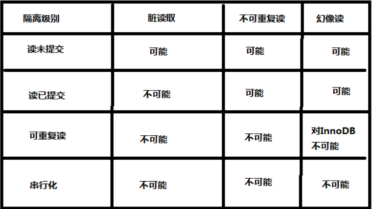

### 1. 事务的定义

* transaction
* 事务:一个完整的不可再分的工作单元,通常一个事务对应一个完整的业务(如:银行转账业务)
* 事务只和DML语言有关,这个和业务逻辑有关，业务逻辑不同，DML语句的个数不同.

### 2. 事务的四大特征(ACID)

* 原子性(A:atomicity):事务是 最小单元,不可再分
* 一致性(C:consistency):事务要不成功,要不失败,保证数据的一致性.
* 隔离性(I:isolation):事务之间相互隔离互不影响
* 持久性(D:durability):事务完成后,数据永久保存在磁盘中

### 3.事务的操作流程

* 开启手动事务:start transaction | begin
* DML语句
* 结束事务:commit | rollback

### 4.事务底层数据更新原理

在事物进行过程中，事务未结束之前，DML语句是不会更改底层数据，只是将历史操作记录一下，在内存中完成记录。只有在事务结束的时候，而且是成功的结束的时候，才会修改底层硬盘文件中的数据

### 5.事务的四大特性之一隔离性

1. 事务A和事务B之间相互隔离
2. 事务的隔离级别:
   1. 已提交读: read commited
   2. 未提交读: read uncommitted
   3. 可重复读: repeatable read
   4. 串行化: serializable

#### 未提交读

    - 事务A和事务B,事务未提交的数据,事务B可以读到
    - 读取到的数据叫做"脏数据"
    - 这种隔离级别最低，这种级别一般是在理论上存在，数据库隔离级别一般都高于该级别

#### 已提交读

    - 事务A和事务B,事务a提交的数据,事务B才能够读到
    - 这这种隔离级别高于未提交读
    - 这种隔离级别可以避免"脏数据"
    - 这种隔离级别会导致"不可重复读"
    - Oracle,SQL server 默认是级别是以提交读

#### 可重复读

    - 事务A和事务B,事务a提交的数据,事务B读取不到
    - 事务B可以重复读取数据
    - 隔离级别高于已提交读
    - 这种隔离级别可以避免"不可重复读",但是会导致"幻读"
    - Mysql默认隔离级别
  
#### 串行化

    - 事务A和事务B,事务A在操作数据库时,事务B只能排队等待
    - 这种隔离级别很少使用,应为通途量太低,用户体验差
    - 这种级别可以避免“幻像读”，每一次读取的都是数据库中真实存在数据，事务A与事务B串行，而不并发

#### 隔离级别和一致性

tag:*[原博客阅读][1]*

[1]:https://blog.csdn.net/w_linux/article/details/79666086
