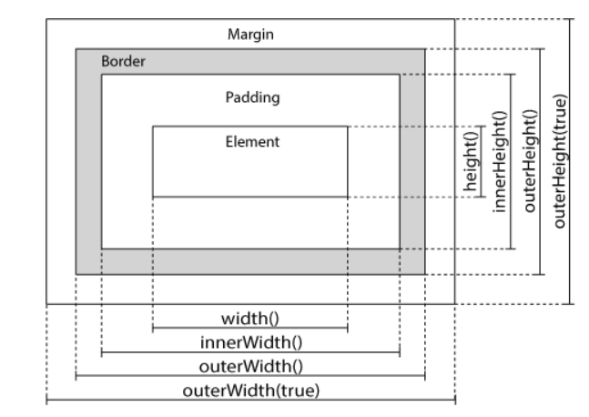

### 1.获取内容

* text()- 设置或返回所选元素的文本内容
* html()- 设置或返回所选元素的内容（包括 HTML 标记）
* val()- 设置或返回表单字段的值
* attr()-获取属性的值

### 2.设置内容

* text()- 设置或返回所选元素的文本内容
* html()- 设置或返回所选元素的内容（包括 HTML 标记）
* val()- 设置或返回表单字段的值
* attr()-设置或获取属性的值

### 3.添加元素

* append() - 在被选元素内部的结尾插入指定内容
* prepend() - 在被选元素内部的开头插入指定内容
* after() - 在被选元素之后插入内容
* before() - 在被选元素之前插入内容

### 4.删除元素

* remove()-删除选中的元素
* empty()-删除选中元素的子元素

*删除指定元素*
$("ele").remove(".xxx||#xxx||xxx")

### 5.css类

* addClass() - 向被选元素添加一个或多个类
* removeClass() - 从被选元素删除一个或多个类
* toggleClass() - 对被选元素进行添加/删除类的切换操作
* css() - 设置或返回样式属性

### 6.jQuery的尺寸

* width()
* height()
  - 仅包括元素尺寸:不包括内外边距及边框
* innerWidth()
* innerHeight()
  - 包括内边距
* outerWidth()
* outerHeight()
  - 包括内边距及边框  

